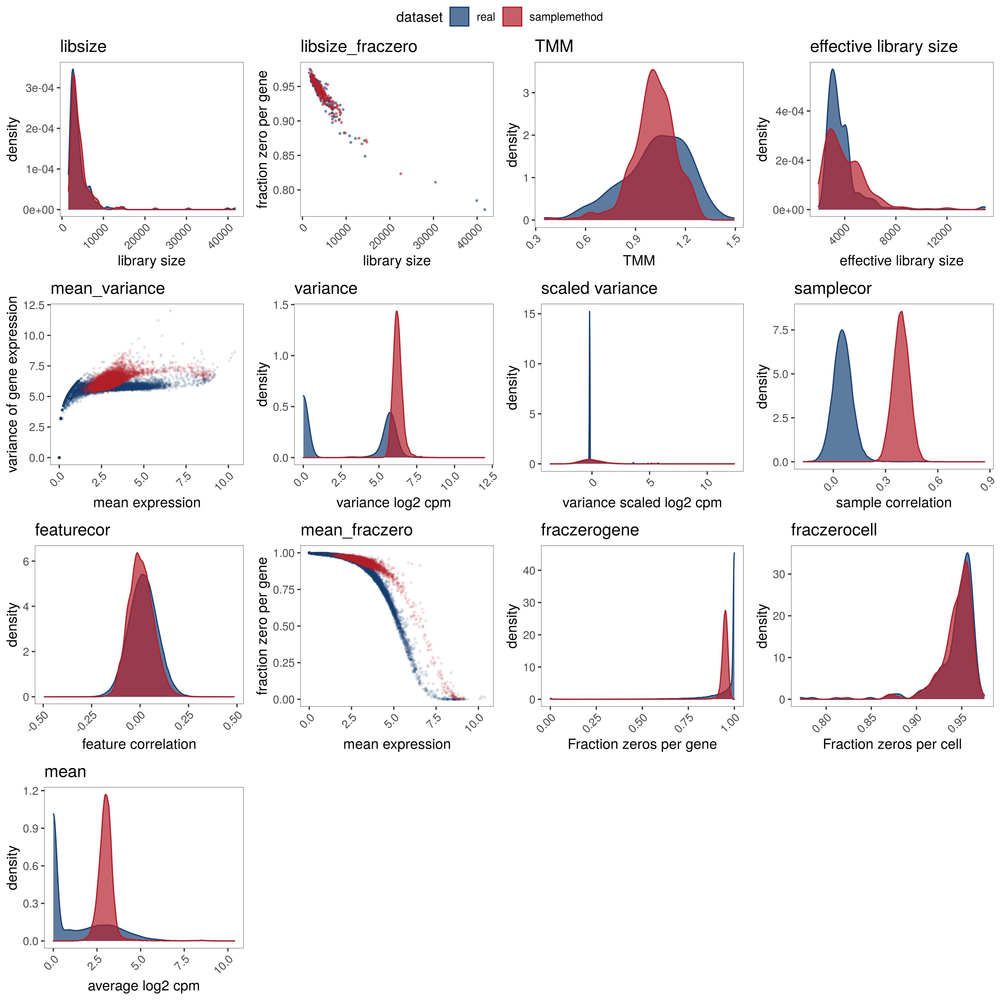
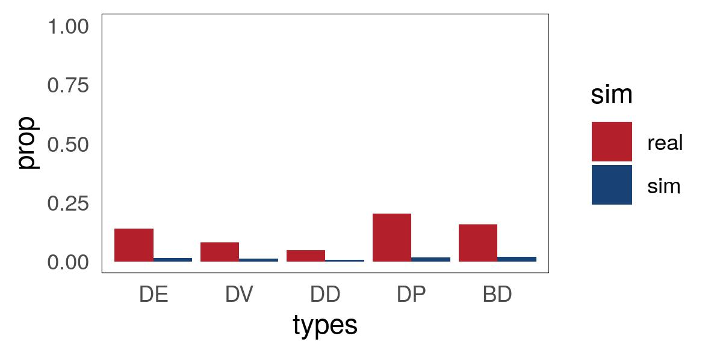

# SimBench: benchmarking of single cell simulation methods


The `SimBench` package is designed for benchmarking simulation methods based on two key aspects of accuracy of data properties estimation and ability to retain biological signals.

In detail, `SimBench`:    
i) quantifies the distributional similarities between a simulated scRNA-seq and a real scRNA-seq data using KDE test (Kernel Density Based Global Two-Sample Comparison Test) across 13 gene-wise and cell-wise properties.      
ii) measures the similarities of the amount of biological signals in a simulated scRNA-seq and a real scRNA-seq data by measuring the proportion difference of DE, DV, DD, BD and BI genes.      


## Installation 


You may need to install the following dependencies first:   

```r
ggthemes, ggpubr, ggplot2, dplyr, plyr, Seurat, SingleCellExperiment, edgeR, DESeq2, caret, ks
```


`SimBench` can be then installed using `devtools`  

```r
library(devtools)
devtools::install_github("SydneyBioX/SimBench")
library(SimBench)
library(parallel)
library(DESeq2)
```


# Getting started 


## Example usage


We have provided a 'simulated' data (`sim.rds`) and a 'real' (`real.rds`) scRNA-seq in the github folder to illustrate the usage of our codes. 


### Load example data 

The files are provided in the `inst\extdata` folder in this github repo .

```r
path <- system.file("extdata", "real.rds", package="SimBench")
real <- readRDS(path)

path <- system.file("extdata", "sim.rds", package="SimBench")
sim <- readRDS(path)
```

Note both the sim and real dataset needs to be SingleCellExperiment object.  
If `celltype` is provided in the object, then the comparison will be made based on each cell type and then combined using a weighted sum (where the weight is the proportion of the cell type).  
if no `celltype` is provided, then the comparison will be made based on the entire dataset. 


### Parameter estimation 

The parameter estimation score can be obtained by : 

```r
parameter_result <- eval_parameter(real = real, sim = sim, type = "raw" , method = "samplemethod")
```
The output contains 3 fields:   
`stats_overall` gives the overall KDE test statistics     
`stats_celltype` gives the KDE test statistics for each cell type   
`stats_raw` gives the raw values used to perform the KDE test (eg, the mean expression of each gene) 


#### Visualise 

We can use the raw value to visualise the simulated dataset and real dataset over 13 parameters. 

```r
distribution_celltype <- parameter_result$raw_value$`B cell`$raw_value #this obtain the distribution of B cell type 
fig <- draw_parameter_plot(distribution_celltype) 
ggarrange( plotlist =  fig ,  common.legend = T)
```



### Maintaining biological signatures

  
Evaluation of biological signals can be obtained by 

```r
signal_result <- eval_signal( real = real, sim = sim  )
```

#### Visualise 

The proportion difference can be visualised using barplot.  

```r
draw_biosignal_plot(signal_result) 
```



# Reference

Part of the codes was inspired and adapted from R package `countsimQC` and `scClassify`.    

>  Soneson, C., & Robinson, M. D. (2018). Towards unified quality verification of synthetic count data with countsimQC. Bioinformatics, 34(4), 691-692.).   
>  Lin, Y., Cao, Y., Kim, H. J., Salim, A., Speed, T. P., Lin, D. M., ... & Yang, J. Y. H. (2020). scClassify: sample size estimation and multiscale classification of cells using single and multiple reference. Molecular systems biology, 16(6), e9389.

Installation of `countsimQC` is however not required for running  `SimBench`.   


